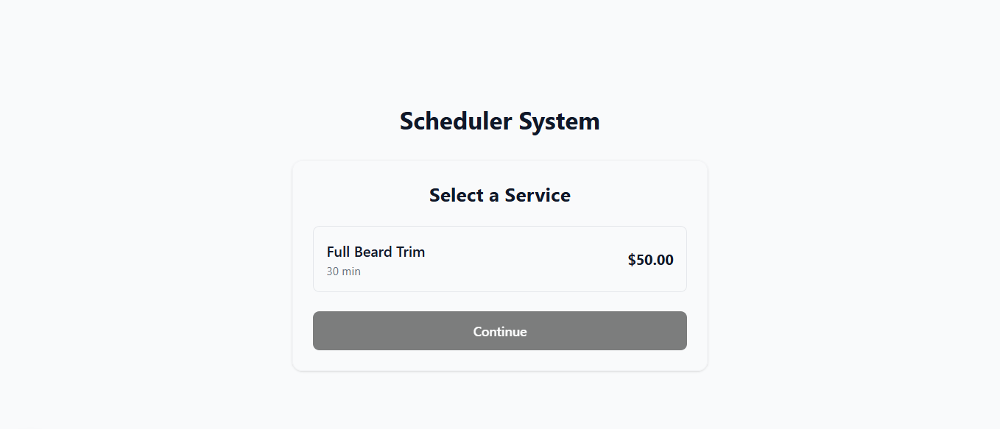
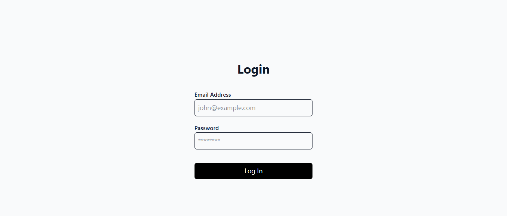
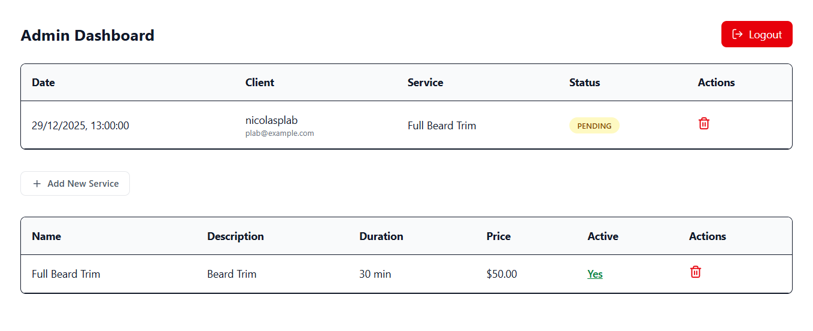

# Sistema de Agendamento

Um sistema full-stack de agendamento, focado em **Clean Architecture**, escalabilidade e segurança, com uma interface pública para clientes e um painel administrativo.


## 🔗 Live Demo: 

Acesso Admin:

- Email: admin@admin.com

- Senha: 123456

## 🚀 Tecnologias

- **Backend:** Node.js, Express, TypeScript
- **Banco de Dados:** PostgreSQL, Prisma ORM
- **Arquitetura:** Clean Architecture (Entities, Use Cases, Repositories, Controllers)
- **Frontend:** Next.js (App Router), Tailwind CSS, React Hook Form
- **Autenticação:** JWT, Cookies HttpOnly e Senhas com Hash (Bcrypt)

## 🏗️ Sobre a Arquitetura

O Backend foi construído seguindo a **Clean Architecture** para desacoplar as regras de negócio de frameworks e bibliotecas externas:

1.  **Domain:** Entidades puras em TypeScript.
2.  **Application:** Use Cases contendo as regras de negócio.
3.  **Infrastructure:** Implementações concretas.

## ✨ Funcionalidades

### Área Pública (Cliente)
- Seleção de serviços com cálculo dinâmico de preço e duração.
- Verificação de disponibilidade de horários para evitar conflitos.
- Interface responsiva e formulário de cadastro simplificado.

### Painel Administrativo (Protegido)
- **Login Seguro:** Autenticação via Token JWT e Cookies.
- **Gestão de Serviços:** Criação e listagem de novos serviços.
- **Gestão de Agendamentos:** Visualização de agenda e alteração de status (Pendente, Confirmado, Cancelado).
- **Dashboard Visual:** Cards com métricas financeiras e status rápidos.

## 🛠️ Instalação

### Pré-requisitos
- Node.js instalado
- PostgreSQL rodando

### 1. Backend
```bash
cd backend
npm install
# Crie o arquivo .env baseando-se no .env.example
npx prisma migrate dev
npm run dev
# O servidor rodará em http://localhost:3333
```

### 2. Frontend
```bash
cd frontend
npm install
# Configure o .env se necessário
npm run dev
# Acesse em http://localhost:3000
```

## 📸 Screenshots

### Área Pública


### Painel Administrativo

